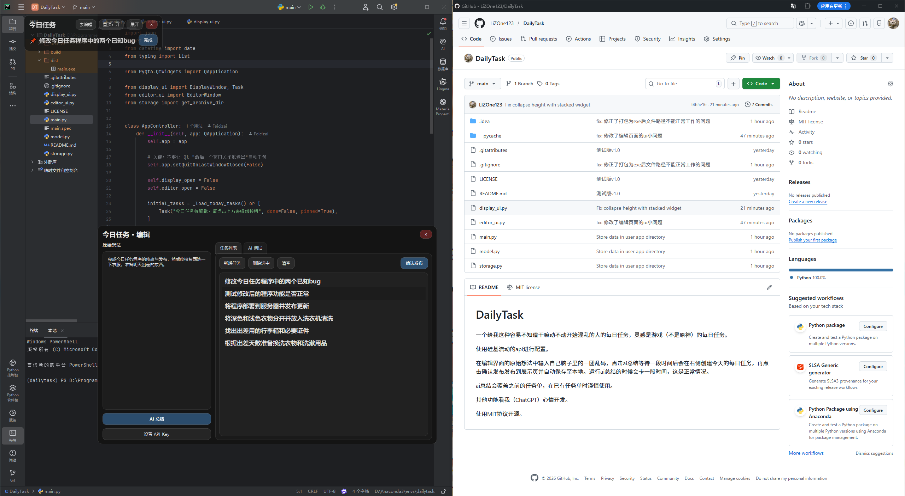

# DailyTask

程序测试图。

一个给我这种容易不知道干嘛、动不动就开始混乱的人的每日任务，灵感是游戏（不是原神）的每日任务。使用硅基流动的api进行配置。默认用的是的Deepseek V3.2，但用下来好像有点幻觉，有很多时候都要自己去额外修改任务描述。

在编辑界面的原始想法中输入自己脑子里的一团乱麻，点击ai总结等待一段时间后会在右侧创建今天的每日任务，再点击确认发布，就会发布到展示页并自动保存至本地。运行ai总结的时候会卡死一段时间，这是正常情况。

保存路径在storage.py内有写，不想给C盘塞垃圾的可以换个地方存放json。

### **ai总结会覆盖之前的任务单，在已有任务单时谨慎使用。**

其他功能看我（ChatGPT）心情开发。目前的待开发计划有：根据每周的任务json进行总结，生成周报，再进一步生成月报和年终总结。但考虑到这样就要求每天都打开这个程序，好像多少有点不合理。所以先暂时这样放着；还有就是对ui的进一步优化。其实我故意没有做最小化按钮，就是不希望自己随手给他最小化了之后就忘在一边了；最后就是每日任务的逻辑。现在只会覆盖以前的任务单。考虑到实际用的时候应该总有在原有任务单上新增任务的需求，但是现在这个版本只能手动添加，所以之后有空会再次修改完善ai增加任务的逻辑。

这应该算是我的第一个程序，还几乎都是ai写的代码，我自己也就改了两三行。里面肯定有很多不成熟的地方，所以如果使用下来有什么问题可以直接说，我会push ai的。

使用MIT协议开源。
